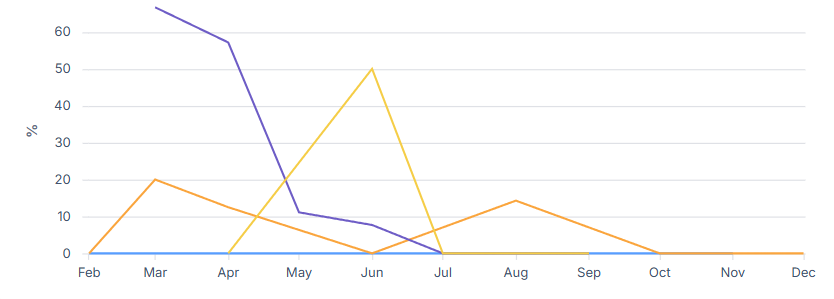

# 👤 KPI: Code Review Failure Rate by Developer

## 📖 Definition
The monthly percentage of a specific developer's user stories that failed the **'Code Review'** status, calculated against the total stories they submitted for review.

> **Purpose:** To identify individual coaching opportunities and spot uneven distribution of rework.

## 💡 Business Value & Coaching
While the aggregate metric shows team health, this breakdown helps the Project Manager support individual contributors.

**Key Signals:**
*   **High Failure Rate:** May indicate a need for mentorship, better understanding of requirements, or slower rushing.
*   **Zero Failure Rate:** Could indicate high competence, or potentially "rubber-stamping" reviews (if they are also a reviewer).
*   **Erratic Spikes:** Usually correlates with a developer taking on a new, unfamiliar technical domain.

## ⚡ Root Cause & Actions
If a specific developer shows a consistently high failure rate, it often points to:
1.  **Unclear Requirements:** The developer is building the "wrong thing."
2.  **Poor Local Testing:** Submitting work with bugs that should have been caught in unit tests.
3.  **Inconsistent Standards:** Misalignment on coding guidelines.

**Managerial Action:**
*   Facilitate 1:1 coaching on the **Definition of Ready**.
*   Review **Pre-review checklists** with the developer.
*   Pair the developer with a senior mentor for complex tickets.

## ⚙️ Technical Implementation
**Defining "Responsibility":**
In a collaborative environment, who "owns" the failure?
*   **Logic:** The SQL uses a `ROW_NUMBER()` window function to identify the **First** person who moved the story to `Ready`.
*   **Assumption:** The person who starts the work is responsible for its quality through the review gate.

## 📊 Visualisation
*(Note: Names in the chart have been anonymized for privacy)*

